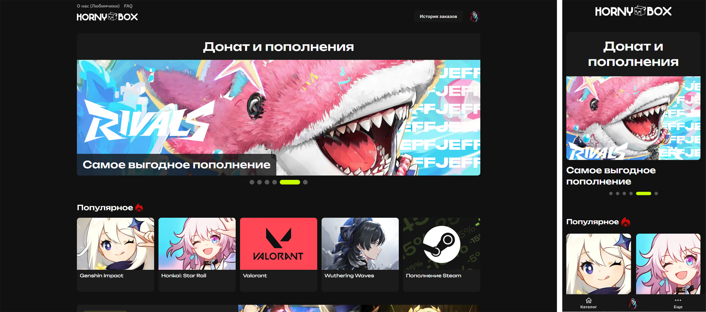
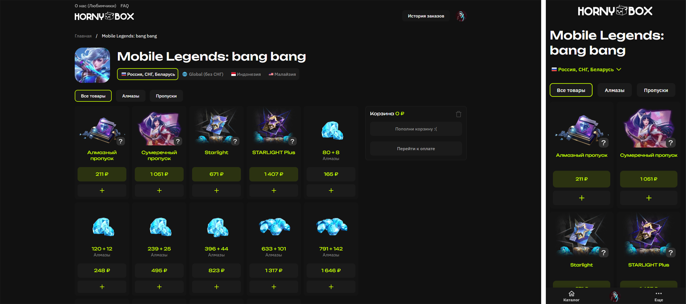
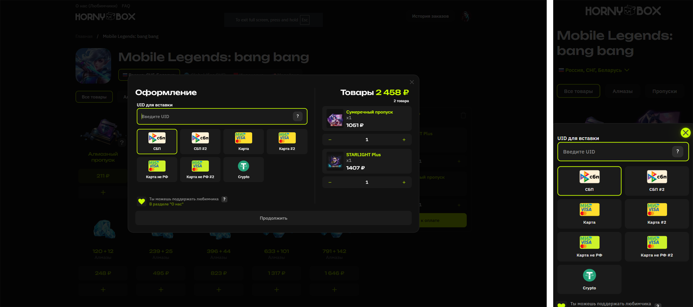
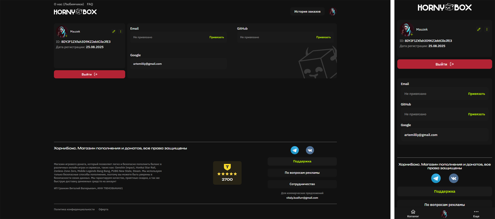
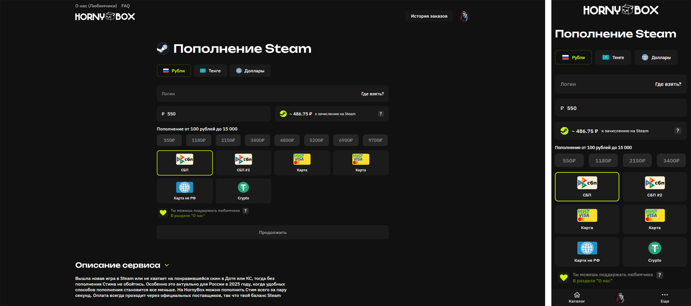

<div align="center">
  
</div>

**Современный онлайн-магазин донатов, пополнений и цифровых товаров для геймеров**

HornyBox Clone — это веб-приложение, повторяющее функционал [hornybox.ru](https://hornybox.ru), с акцентом на удобство, скорость и современный дизайн.

## [**DEMO**](https://horny-box.vercel.app/)
---

## 📸 Скриншоты

<div align="center">

### Главная страница


### Категории товаров


### Форма оформления


### Профиль


### Страница пополнения Steam


</div>

---

## ✨ Основные возможности

- Пополнение Steam, покупка ключей и внутриигровых валют
- Регистрация, восстановление пароля
- Авторизация через почту, Google и Github
- Просмотр статей и видео от блогеров прямо на сайте
- Система избранного и поддержка любимых блогеров
---

## 🛠 Технологический стек

### **Frontend**
- **React 18** — современная библиотека для создания пользовательских интерфейсов
- **TypeScript** — типизированный JavaScript для надежности кода
- **Vite** — быстрый сборщик и dev-сервер
- **React Router DOM** — маршрутизация страниц

### **Управление состоянием**
- **Redux Toolkit** — современное управление состоянием приложения

### **Стилизация**
- **SCSS/Sass** — препроцессор CSS для переменных и миксинов
- **CSS Modules** — изолированные стили для компонентов
- **React Icons** — коллекция SVG-иконок

### **API и данные**
- **Axios** — HTTP клиент для запросов к API
- **Firebase** — аутентификация, база данных, хранение файлов

### **Дополнительные возможности**
- **Адаптивная верстка** — поддержка мобильных устройств
- **Lazy Load** — ленивая загрузка изображений и компонентов
- **Custom Hooks** — пользовательские хуки для логики

## 🚀 Быстрый старт

### Предварительные требования
- Node.js 18+ 
- npm или yarn

### Установка

```bash
# Клонирование репозитория
git clone https://github.com/Mauzek/HornyBox.git
cd HornyBox

# Установка зависимостей
npm install

# Запуск в режиме разработки
npm run dev
```

### Сборка для продакшена

```bash
# Создание production сборки
npm run build

# Предварительный просмотр сборки
npm run preview
```
---

## 📁 Структура проекта

```
src/
├── 📂 api/               # API клиенты и утилиты
├── 📂 assets/            # Статические ресурсы
│   ├── 📂 fonts/         # Шрифты
│   ├── 📂 icons/         # SVG-иконки
│   └── 📂 images/        # Изображения и логотипы
├── 📂 components/        # React компоненты
├── 📂 config/            # Конфигурация окружения и Firebase   
├── 📂 hooks/             # Пользовательские хуки
├── 📂 pages/             # Страницы приложения
│   ├── 📂 Home/          # Главная страница
│   ├── 📂 About/         # О проекте
│   ├── 📂 Auth/          # Авторизация
│   ├── 📂 Content/       # Статьи и видео
│   ├── 📂 FAQ/           # Вопросы и ответы
│   ├── 📂 Profile/       # Профиль пользователя
│   ├── 📂 Services/      # Услуги и донаты
│   ├── 📂 Videos/        # Видео от блогеров
│   ├── 📂 NotFound/      # Страница 404
│   ├── 📂 Politics/      # Страница политики конфиденциальности
│   └── 📂 [productName]  # Динамические страницы товаров
├── 📂 store/             # Redux store и слайсы
├── 📂 styles/            # SCSS стили и переменные
├── 📂 types/             # TypeScript типы
└── 📂 utils/             # Утилиты и хелперы
```
---

## 🔧 Конфигурация

### Переменные окружения

Создайте файл `.env.local` и добавьте свои ключи Firebase:

```env
VITE_FIREBASE_API_KEY=YOUR_API_KEY
VITE_FIREBASE_AUTH_DOMAIN=YOUR_AUTH_DOMAIN
VITE_FIREBASE_DATABASE_URL=YOUR_DATABASE_URL
VITE_FIREBASE_PROJECT_ID=YOUR_PROJECT_ID
VITE_FIREBASE_STORAGE_BUCKET=YOUR_STORAGE_BUCKET
VITE_FIREBASE_MESSAGING_SENDER_ID=YOUR_MESSAGING_SENDER_ID
VITE_FIREBASE_APP_ID=YOUR_APP_ID
VITE_FIREBASE_MEASUREMENT_ID=YOUR_MEASUREMENT_ID
```

---


## 📱 Мобильная версия

HornyBox Clone полностью адаптирован для мобильных устройств:

- **Отзывчивый дизайн** для всех размеров экранов
- **Touch-friendly** интерфейс
- **Оптимизированная навигация** для мобильных устройств
- **Быстрая загрузка** на медленных соединениях

---

## 👨‍💻 Автор

**Mauzek**
- GitHub: [@Mauzek](https://github.com/Mauzek)
- Проект: [HornyBox](https://github.com/Mauzek/HornyBox)

---


<div align="center">

**⭐ Поставьте звезду, если проект вам понравился!**

[🐛 Сообщить об ошибке](https://github.com/mauzek/hornybox/issues) • [💡 Предложить улучшение](https://github.com/mauzek/hornybox/issues)

</div>

---

**Внимание:** проект создан в ознакомительных целях и не предназначен для коммерческого использования. Все торговые марки и логотипы принадлежат их владельцам.